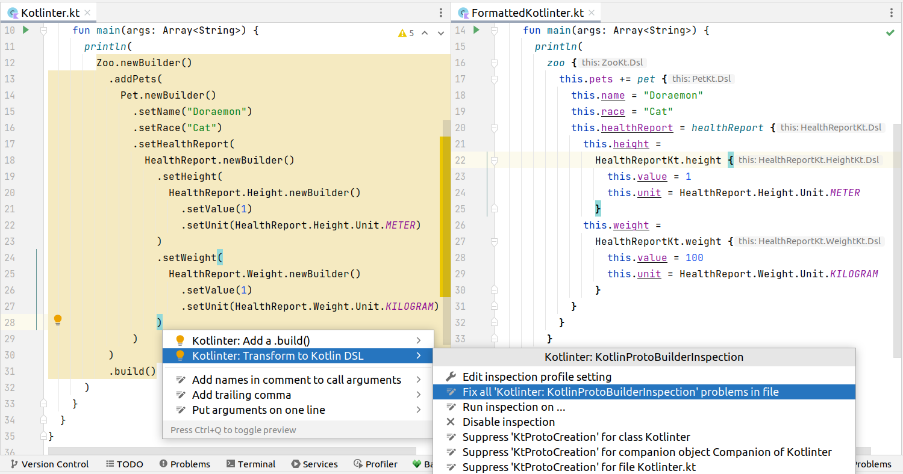

# Kotlinter

## Motivation

Google has recently introduced
[a brand-new Kotlin DSL for Protocol Buffers]("https://developers.googleblog.com/2021/11/announcing-kotlin-support-for-protocol.html)
and due to some reasons, I am migrating a huge Java code base with a lot
of [Protocol Buffers](https://developers.google.com/protocol-buffers) to
[Kotlin](https://kotlinlang.org/). I really love to make my code as idiomatic and consistent as possible but at the same
time,
rewriting those protos is too much more work than I am willing to handle. That's the reason why I am writing Kotlinter.

## Kotlinter



This plugin will be integrated with IntelliJ (the number one IDE for Kotlin). It can automatically detect legacy Java
style proto builders like

```kotlin
Message.newBuilder().setFieldOne(1).addFieldTwo(2).build()
```

and suggest fixes which can be applied to multiple non-nesting protos at once to transform your code into more idiomatic
Kotlin DSL

```kotlin
message {
  this.fieldOne = 1
  this.fieldTwo += 2
}
```

Unfortunately, it won't help you with the imports yet, meaning that you will still need to make sure that the generated
Kotlin dependencies are available and import them yourself. Right now, there is no way to support automatic importing.
Of course, we will add more features in the future, so please keep yourself updated. You can explore and customize
features by searching for **Kotlinter** in **Settings**.

## Who should use this plugin?

Do you

* Enjoy [Kotlin](https://kotlinlang.org/)?
* Work a lot with [Protocol Buffers](https://developers.google.com/protocol-buffers)?
* Have a huge Java code base to modernize?

If yes, you are coming to the right place.

## Contribution

We would appreciate your contribution to make it better.

**IMPORTANT**: Currently, this project lacks tests (in the sense that it doesn't have any test at all). Jetbrains
documentation in this regard is very poor to the point of incomprehensible. Therefore, I couldn't add more features as
manual testing is hard. If you can understand Jetbrains documentation (if exists) or if you would
like to see this product in more active development, I would appreciate your contribution to add tests.
